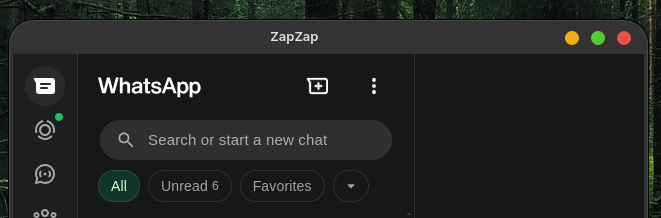
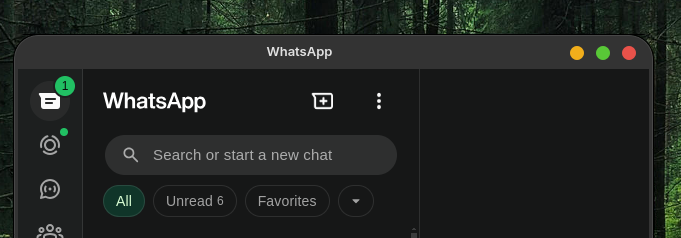

# retitle-flatpak

Before: 

 

After: 




A bash script to change the window title of Flatpak apps by patching their interpreted source files (Python/JS).

## Why this ahh tool exists?

Born from trying to rename the [ZapZap](https://flathub.org/apps/com.rtosta.zapzap) WhatsApp wrapper window to match my customization, because the original title is "ZapZap" and I don't like it. And then discovering that KWin's "Special Window Settings" only identifies windows, not renames them.

So i did this in my free time only for fun and for save myself time in the future if I want to change something like that.

----

## Why this overcomplicated method?
On **Wayland**, no external process can change the window title of another app — the protocol simply doesn't allow it. Tools like `wmctrl`, `xdotool`, and KWin special window rules can't do it either (those are window identifiers, not title setters)

The only real way in is **inside the app's own source**. Many Flatpak apps are written in Python or JS, meaning their source ships readable and patchable. This script finds the window title call and replaces the string directly.

For Electron apps specifically, the JS code is bundled inside an `app.asar` archive — the script extracts it, patches it, and repacks it automatically.

**Only tested on:** Fedora 44 · KDE Plasma · Wayland

---

## Compatibility

Honestly, I can't guarantee this works for every app out there, but you can try! This tool was created precisely so you don't have to keep messing with the files every time you want to do something like this!

### 🐍 Python Based — ✅ Supported
Python apps ship their source as plain `.py` files, so patching is reliable.

### 🌐 Electron / JavaScript Based — 🟡 Depends on the app
Electron apps bundle their JS inside `app.asar`. The script extracts, patches, and repacks it automatically — but it only works if the title is set as a plain string literal in the code. Apps that minify or obfuscate their JS, or set the title dynamically, won't work.

### ☕ Java / JVM Based — 🔴 Not supported
Compiled bytecode, no readable source. Out of scope entirely.

---

## Installation

```bash
git clone https://github.com/ezerevello/retitle-flatpak
cd retitle-flatpak
chmod +x install.sh
./install.sh
```

`install.sh` copies the script to `~/.local/bin` and handles `$PATH` automatically — it detects your shell (zsh, bash, fish, ksh) and adds `~/.local/bin` to your config file only if it isn't already there.

**Supported shells:** zsh · bash · fish · ksh

---

## Usage

```bash
retitle-flatpak <APP_ID> "<new title>"
```

### Examples

```bash
retitle-flatpak com.rtosta.zapzap "WhatsApp"
```

To find the App ID of any installed Flatpak:

```bash
flatpak list --app
```

---

## How it works

1. Resolves the installation path of the Flatpak via `flatpak info --show-location`
2. **Python/GTK apps:** scans `.py` files for any supported title pattern, shows matches and asks for confirmation, then patches with `sudo sed -i`
3. **Electron apps:** finds `app.asar`, extracts it to a temp dir using the `asar` tool, patches the `.js` files inside, repacks and replaces the original with `sudo`
4. The change takes effect on next app launch

### Supported frameworks

| Pattern | Framework |
|---|---|
| `setWindowTitle(_("Title"))` | PyQt / PySide + gettext |
| `setWindowTitle("Title")` | PyQt / PySide plain |
| `.set_title(_("Title"))` | GTK Python + gettext |
| `.set_title("Title")` | GTK Python plain |
| `.setTitle("Title")` | Electron / JS (via asar) |

### Electron requirement
For Electron apps, the script needs the `asar` tool. If it's not installed, the script will tell you. You can install it with:

```bash
npm install -g asar
```

Or just have Node.js installed and the script will use `npx asar` automatically.

---

## Limitations

| Limitation | Details |
|---|---|
| **Interpreted apps only** | Works for Python and non-obfuscated JS. Compiled apps (C++, Rust, Go, Java) are out of scope. |
| **Patches lost on update** | Flatpak updates restore the original files. Re-run the script after every app update. |
| **Translated titles** | Apps using `_("Title")` (gettext) may revert the title at runtime based on locale. |
| **Wayland only concern** | On X11 you could use `xdotool` instead. This tool targets Wayland where that's not an option. |
| **Minified Electron JS** | Some Electron apps (Discord, VS Code, Signal) obfuscate their code — the title won't appear as a plain string and can't be patched this way. |

---

## Reverting a change

Re-run with the original title:

```bash
retitle-flatpak com.rtosta.zapzap "ZapZap"
```

Or reinstall the app to restore all original files:

```bash
flatpak repair com.rtosta.zapzap
# or
flatpak uninstall com.rtosta.zapzap && flatpak install com.rtosta.zapzap
```


